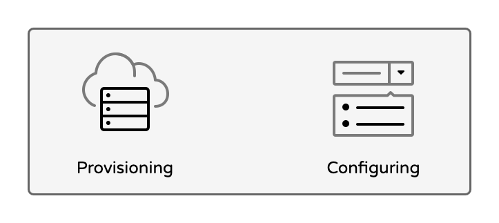
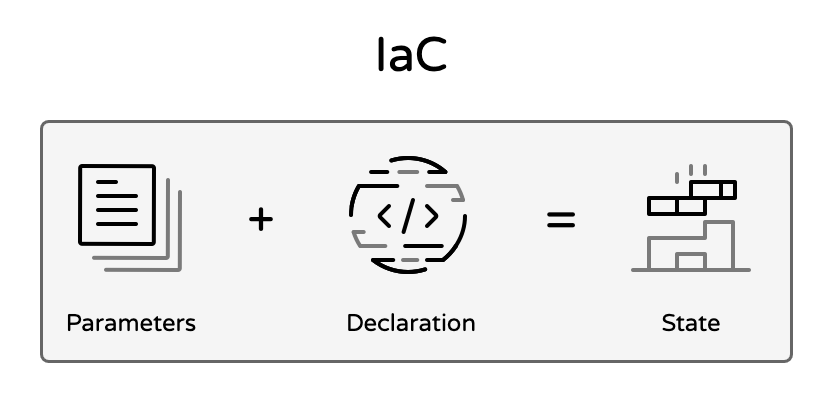

# Demo Days 2021 - How GitHub uses infrastructure as code
##### Top


An inside look at how the GitHub team uses Infrastructure as Code (IaC) to power a successful unified DevOps platform. We will demonstrate how we use the principles of shared ownership and rapid feedback, empowered by automation, to deploy GitHub safely and reliably at scale


# Part-1

# Some *"thoughts"* about IaC

<br><br>

## ***Provisioning*** vs ***Configuring***



- ### We create Infrastructure to host applications or services

IaC should focus on the infrastructure part as much as possible and be decoupled from the service configuration.
This is easier said then done, but take it as a guideline. 

If too much application/service specific configuration ends up in IaC, you create dependencies between IaC and the app that can become difficult to detangle. 

As always there are edgecases or *"exceptions to the rule"* and an Appliance can be such a case.

Bundled with a preconfigured OS, it requires certain application configuration to be added to your IaC.

If you use your IaC in an ephemeral way, this might never become a problem but if you maintain a larger production (long lived) infrastructure, maintaining these configurations can become challenging.

Basic *"Rule of thumb"*... 

- Provisioned infrastructure usually requires some baseline configuration, network settings, system settings etc. but beyond that baseline no application level configuration should be included.

>Note: Many IaC tools provide no clear boundries between Provisioning and Configuring.
We can *"stretch"* the tools to do what we want but check twice if this is the best solution.

<br><br><br><br>

## IaC should give you...

  - ### **Immutable** Infrastructure (cats vs cattle)
    - #### unchangable, just destroy and rebuild it when needed


<br>

  - ### **Idemtoptent** Infrastructure 
    - #### no matter how many times you run it, you get the same (declared) results

<br>

  - ### **An automated process** to setup consistent, managed infrastructure.

<br>

  - ### **Change-Control** not *"Change-Forensics"*

<br><br><br><br>

## Where to apply IaC in your Enterprise ?

### *"Food for thought"*...

- ### Do you need the power of a full infrastructure for your build process ? Or would Docker be enough ?

- ### Use it when you need a "realistic" test environment (ephemeral) !

- ### Use it to maintain a fully managed Production environment

<br><br><br><br>

## What makes IaC work ?!

- ### Ideally your source control platform (GitHub) has to be the source of truth!
  - #### If a resource is not declared in GitHub-IaC it should not exist

<br>

- ### Avoid Infrastructure changes outside the IaC workflow (Drift)
  - #### IaC workflow == GitHub workflow

<br>

- ### Trust your IaC! 
  - #### Know that your IaC is still valid and up to date. 
  - #### Excercise frequent infrastructure rebuilds with you IaC, even production.


<br><br><br><br>


# Part-2

# IaC on GitHub

### *"Parts"* of IaC




|||
|---|---|
||**Parameter** repository define stack provisioning |
|**Declaration** repository define stack|
|**Store** stack state|

<br><br>
### IaC follows the GitHub workflow 


<br><br><br><br>

## At GitHub we work asynchronously, and to make that possible we have to...
  - ### Prevent resource *"bottlenecks"*
  - ### Enable **global collaboration**. Location and timezone become a minor issue.

<br><br><br><br>

[:arrow_up: Top](#Top) - [:arrow_left: Previous](#Part-2) - [Next :arrow_right:](#Part-4)

# Part-3

# The *"Demo-Stack"*

<table  border="0px"><tr><td></td><td><h3>GitHub Professional services uses IaC to setup GitHub Enterprise systems with a variaty of stack combinations, including 3rd party tools.</h3></td></tr></table>


## IaC & Self-Service


<br><br><br><br>

### Step 1

```bash
$>
```

### Step 2

```bash
$>
```

### Step 3

```bash
$>
```

### Step 4

```bash
$>
```

<br><br><br><br>

[:arrow_up: Top](#Top) - [:arrow_left: Previous](#Part-2)