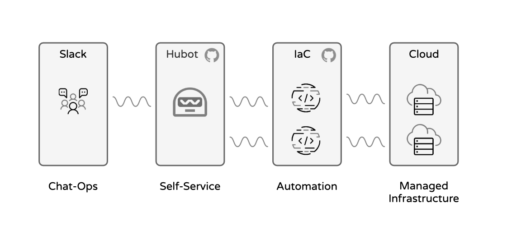
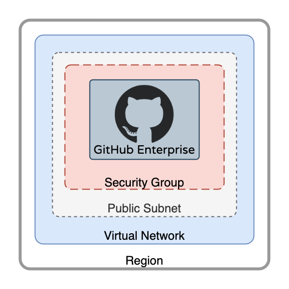

# Demo Days 2021 - How GitHub uses infrastructure as code
##### Top


### An inside look at how the GitHub team uses Infrastructure as Code (IaC) to power a successful unified DevOps platform. 

### We will demonstrate how we use the principles of shared ownership and rapid feedback, empowered by automation, to deploy GitHub safely and reliably at scale


## Overview 

This repository contains the code to build a **Terraform** based, **Hubot** supported, **self-services** IaC setup, on **multiple cloud** environments (Azure, AWS). 

See the picture below for the workflow overview.



The IaC declaration(s) in this Repository stand up a basic (minimal) GitHub Enterprise Server, of any version that is currently provided by GitHub as an Appliance.

### An example of the basic stack


[:arrow_up: Top](#Top) 


## Requirements


### Terraform

Make sure you have [Terraform installed](https://learn.hashicorp.com/tutorials/terraform/install-cli) on your localhost

### Node / NPM

Install [NPM/Node](https://www.npmjs.com/get-npm)

This is required for Hubot Code.

### Azure Account Access (credentials setup)

You should have an Azure account and setup the local AZ CLI environment, see the [Azure reference](https://registry.terraform.io/providers/hashicorp/azurerm/latest/docs/guides/service_principal_client_secret) for Terraform details.

### AWS Account Access

You should have an AWS account and setup the local AWS CLI environment, see the
 [AWS reference](https://registry.terraform.io/providers/hashicorp/aws/latest/docs#authentication) for Terraform details.

### Hubot

Some useful information on [Hubot](https://hubot.github.com/docs/). 

The Repository already contains a Hubot project, so there should be no need to setup a new project, but this information can provide a better understanding.

### ChatOps

Make sure you have a Slack account, since we are using Slack and the [Hubot Slack adapter](https://slack.dev/hubot-slack/) for this demo (other Hubot adapters are available)

Here are some notes on how to [install a Slack Bot](https://api.slack.com/authentication/migration#classic), to support our Hubot and enable the Self-Service.


[:arrow_up: Top](#Top) 


##  Setup

### Step 1

```bash
$>
```

### Step 2

```bash
$>
```

### Step 3

```bash
$>
```

### Step 4

```bash
$>
```

[:arrow_up: Top](#Top) 

